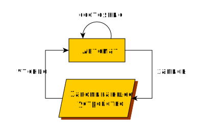

##  Автомат с памятью
автомат с памятью (eng: automatic machine with memory) 

## Определение
Конечный автомат с памятью — математическая модель устройства, поведение которого зависит как от входных условий, так и от предыдущего состояния.

## Примечание

На схеме показана замкнутая система, так как для определения абстрактного вычислителя вопросы взаимодействия с внешним миром не являются первостепенными: будем считать, что взаимодействие может осуществляться через запоминающее устройство.

## Связь с другими понятиями
[машина Тьюринга](turing_machine.md)
## Библиография
[polykarpov-programming-book](../bibliography/polykarpov-programming-book.md)
