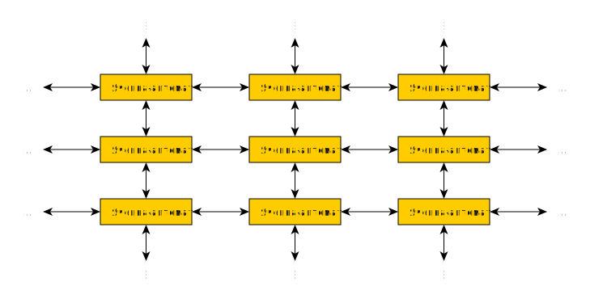

##  Клеточный автомат
клеточный автомат(eng: cellular automaton) 

## Определение
Клеточным автоматом называют структуру, составленную из синхронизированных (выполняют шаги одновременно) соединённых автоматов (обычно конечных), где на вход каждого из них поступает набор выходов некоторого набора соседних автоматов (“ячеек” cells), составляющих “окрестность” neighborhood. Соответственно, выход каждой ячейки дублируется для всех ячеек из её окрестности. Обычно предполагается, что структура автомата регулярна и количество ячеек велико (или даже бесконечно).

## Примечание

Клеточный автомат на основе прямоугольной двумерной сетки:

## Связь с другими понятиями
[машина Тьюринга](turing_machine.md)
## Ссылка на библиографию
[polykarpov-programming-book{2}](../bibliography/polykarpov-programming-book%7B2%7D.md)
