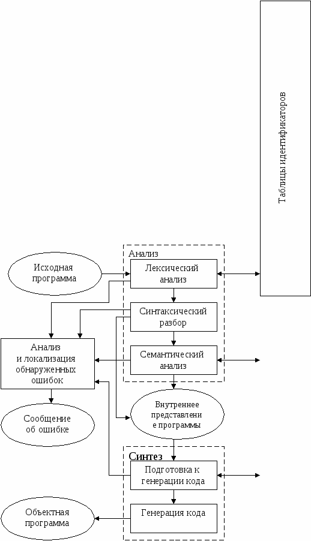

## Компилятор
компилятор(eng: compiler) 

## Определение
Компилятор —  программа, переводящая написанный на языке программирования текст в набор машинных кодов. 

## Примечание

Процесс компиляции состоит из следующих этапов:

 - [Лексический анализ](lexical_analyzer_1.md). На этом этапе последовательность символов исходного файла преобразуется в последовательность лексем.

 - [Синтаксический (грамматический) анализ](parser.md). Последовательность лексем преобразуется в дерево разбора.

 - [Семантический анализ](semantic_analyzer_1.md). Дерево разбора обрабатывается с целью установления его семантики (смысла) — например, привязка идентификаторов к их декларациям, типам, проверка совместимости, определение типов выражений и т. д. Результат обычно называется «промежуточным представлением/кодом», и может быть дополненным деревом разбора, новым деревом, абстрактным набором команд или чем-то ещё, удобным для дальнейшей обработки.

 - [Оптимизация](code_optimization.md). Выполняется удаление излишних конструкций и упрощение кода с сохранением его смысла. Оптимизация может быть на разных уровнях и этапах — например, над промежуточным кодом или над конечным машинным кодом.

 - [Генерация кода](code_generation.md). Из промежуточного представления порождается код на целевом языке.

В конкретных реализациях компиляторов эти этапы могут быть разделены или, наоборот, совмещены в том или ином виде.

Общая схема работы компилятора:

## Примеры компилируемых языков
- C
- C++
- C#
- Go
- Swift
- Delphi
## Связь с другими понятиями

[виртуальная машина](virtual_machines_1.md)

[информационные таблицы](information_tables.md)

[оптимизация кода](code_optimization.md)

[код операции](operation_code.md)

[интерпретатор](interpreter_1.md)

[компиляция](compiler_1.md)

[лексический анализатор](lexical_analyzer_1.md)

[синтаксический анализатор](parser.md)

[семантический анализатор](semantic_analyzer_1.md)
             
[генерация промежуточного кода](code_generation.md)
         
[байт-код](byte-code.md)
         
[машинный код](machine_code_1.md)
         

## Cсылка на библиографию
[aho-compilers-book{5}](../bibliography/aho-compilers-book%7B5%7D.md)

