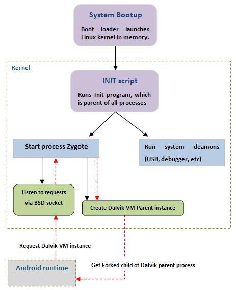
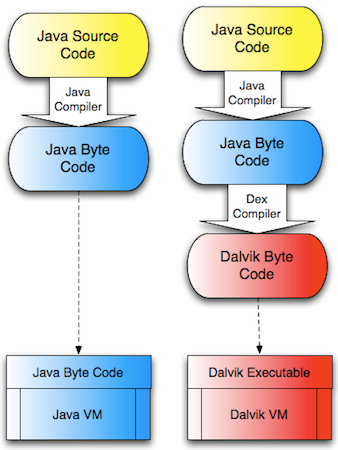

## Далвик
далвик (eng: dalvik) 

## Определение
DALVIK – реализованная google виртуальная машина для Android и выполняющая функцию интерпретатора java кода на устройствах под управлением этой ОС. Для выполнения процесса Android создает отдельный экземпляр [виртуальной машины](virtual_machines_1.md). Это снижает вероятность краха системы при падении одного из приложений. Dalvik реализует регистровую модель и в отличаи от стандартного java [байткода](byte-code.md), который выполняет 8 битные инструкции на стековой [JVM](java_virtual_machine.md), использует 16 битные инструкции. [Регистры](register.md) реализованы в Dalvik в виде 4 битных полей.

## Примечание

Если мы хотим получить более детальную информацию о том как процесс получает экземпляр [виртуальной машины](virtual_machines_1.md), мы должны начать рассмотрение с момента загрузки ядра Linux в Android:

Dalvik отличается от обычной [виртуальной машины Java](java_virtual_machine.md) тем, что она выполняет байткод Dalvik, отличный от обычного java байткода. Промежуточный шаг между Java компилятором и Dalvik VM, на котором происходит преобразование Java байткода в байткод Dalvik берет на себя DEX компилятор. Раличие между JVM и Dalvik проилюстрировано на следующей диаграмме:

DEX компилятор преобразует .class файлы java в .dex файлы, которые имеют меньший размер и оптимизированы для Dalvik VM.

## Cвязь с другими понятиями 
[набор команд далвик](command_set_Davlik.md)
