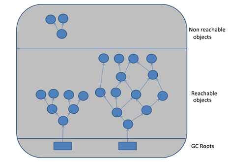

## Сборка мусора
сборка мусора(eng: garbage collection) 

## Определение
Сборщик мусора выполняет всего две задачи, связанные с поиском мусора и его очисткой.
## Примечание
Для обнаружения мусора существует два подхода :

 - Reference counting – учет ссылок;

 - Tracing – трассировка.

Reference counting:

Суть подхода «Reference counting» связана с тем, что каждый объект имеет счетчик, который хранит информацию о количестве указывающих на него ссылок. При уничтожении ссылки счетчик уменьшается. При нулевом значении счетчика объект можно считать мусором.

Главным недостатком данного подхода является сложность обеспечения точности счетчика и «невозможность» выявлять циклические зависимости. Так, например, два объекта могут ссылаться друг на друга, но ни на один из них нет внешней ссылки. Это сопровождается утечками памяти. В этой связи данный подход не получил распространения.

Tracing:

Главная идея «Tracing» связана с тем, что до «живого» объекта можно добраться из корневых точек (GC Root). Всё, что доступно из «живого» объекта, также является «живым». Если представить все объекты и ссылки между ними как дерево, то необходимо пройти от корневых узлов GC Roots по всем узлам. При этом узлы, до которых нельзя добраться, являются мусором.

## Связь с другими понятиями
[виртуальная машина java](java_virtual_machine.md)
## Cсылка на библиографию
[tanenbaum-systems-book{3}](../bibliography/tanenbaum-systems-book%7B3%7D.md)
