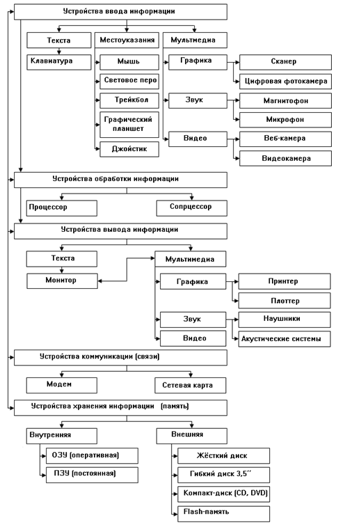

## Аппаратное обеспечение
аппаратное обеспечение(eng: hardware) 

## Определение
Аппаратное обеспечение компьютера — электронные и механические части вычислительного устройства, входящие в состав системы или сети, исключая программное обеспечение и данные (информацию, которую вычислительная система хранит и обрабатывает).

## Примечание
Структура аппаратного обеспечения ПК:

Устройства, входящие в состав системного блока:
   
|     Блок                             |           Устройство                                                                                                   |
| -------------------------------------|-----------------------------------------------------------------------------------------------------------------------:| 
| Основные блоки                       | системный блок, монитор, устройства ввода-вывода                                                                       | 
| Устройства в составе системного блока| материнская плата, центральный процессор, оперативная память, жёсткий диск, графическая плата, звуковая плата, сетевая                                              плата, дисковод, CD-привод, DVD-привод, TV-тюнер                                                                       |                 
| Периферийные устройства	принтер     | сканер, графопостроитель, модем, микрофон, акустика, ИБП, клавиатура                                                   |       

## Связь с другими понятиями
[управление памятью](memory_management.md)
## Cсылка на библиографию
[denisov-procuring-book](../bibliography/denisov-procuring-book.md)

