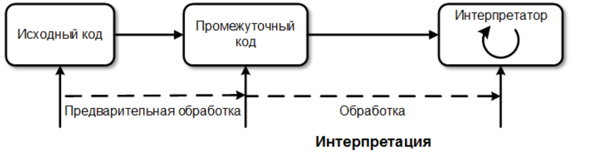

## Интерпретатор
интерпретатор(eng: interpreter) 

## Определение
Интерпретатор — переводит и выполняет программу строка за строкой, производит пооператорный (покомандный, построчный) анализ, обрабатывает и тут же выполняет исходную программу или запроса (в отличие от [компиляции](compilation_process.md), при которой программа транслируется без её выполнения).

## Примечание
Типы интерпретаторов:

- Простой интерпретатор анализирует и тут же выполняет (собственно интерпретация) программу покомандно (или построчно), по мере поступления её исходного кода на вход интерпретатора. Достоинством такого подхода является мгновенная реакция. Недостаток — такой интерпретатор обнаруживает ошибки в тексте программы только при попытке выполнения команды (или строки) с ошибкой.

 - Интерпретатор компилирующего типа — это система из компилятора, переводящего исходный код программы в промежуточное представление, например, в байт-код или p-код, и собственно интерпретатора, который выполняет полученный промежуточный код (так называемая виртуальная машина). Достоинством таких систем является большее быстродействие выполнения программ (за счёт выноса анализа исходного кода в отдельный, разовый проход, и минимизации этого анализа в интерпретаторе). Недостатки — большее требование к ресурсам и требование на корректность исходного кода. Применяется в таких языках, какJava,Tcl,Perl(используется байт-код), а также в различных СУБД.

Общая схема работы интерпретатора:

## Примеры интерпретируемых языков
- Python
- JavaScript
- LISP
- Perl
- Ruby
- Pascal
- PHP
## Связь с другими понятиями
[промежуточный код](byte-code.md)

[виртуальная машина](virtual_machines_1.md)

[компилятор](compiler_1.md)
## Cсылка на библиографию
[aho-compilers-book{7}](../bibliography/aho-compilers-book%7B7%7D.md)
