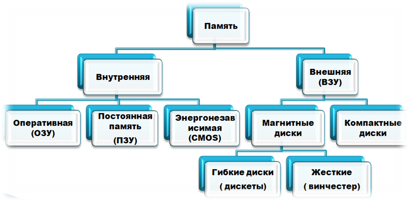

## Память
память (eng: memory) 

## Определение
Память— часть вычислительной машины, физическое устройство или среда для хранения данных, используемая в вычислениях систем в течение определённого времени.
## Пример

## Cвязь с другими понятиями 
[управление памятью](memory_management.md)
## Cсылка на библиографию
[harris-architecture-book](../bibliography/harris-architecture-book.md)

