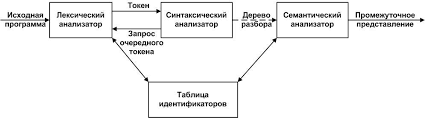

## Парсер
парсер(eng: parser) 

## Определение
Парсер(синтаксический анализ) —  это часть [компилятора](compiler_1.md), которая отвечает за выявление основных синтаксических конструкций входного языка.
## Задачи

Задачи синтаксического анализа:

- найти и выделить основные синтаксические конструкции в тексте входной программы;

- установить тип и проверить правильность каждой синтаксической конструкции;

 представить синтаксические конструкции в виде, удобном для дальнейшей генерации текста результирующей программы.
## Алгоритм

Алгоритмы синтаксического разбора:

Нисходящий парсер –  один из методов определения принадлежности входной строки к некоторому формальному языку, описанному LL(k) контекстно-свободной грамматикой. Это класс алгоритмов грамматического анализа, где правила формальной грамматики раскрываются, начиная со стартового символа, до получения требуемой последовательности токенов.

-LL парсер

-рекурсивный парсер

Восходящий парсер – предназначен для построения дерева разбора, начиная с листьев и двигаясь вверх к корню дерева разбора, нужна леворекурсивная грамматика.

-LR-парсер, SLR-парсер

-LALR-парсер, GLR-парсер
## Примечание
Место синтаксического анализатора в структуре компилятора:

## Связь с другими понятиями
[компилятор](compiler_1.md)
## Cсылка на библиографию
[tanenbaum-architecture-book{6}](../bibliography/tanenbaum-architecture-book%7B6%7D.md)

