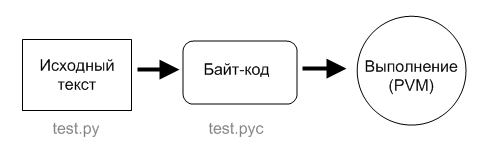

## Виртуальная машина Python
виртуальная машина "Python" (eng: python virtual machine) 

## Определение
PVM - это механизм времени выполнения, она всегда присутствует в составе системы Python и это тот самый программный компонент, который выполняет ваши сценарии.

## Примечание
После того как пройдет [процесс компиляции](compilation%20process.md), [байт-код](byte-code.md) передается механизму под названием [виртуальная машина](virtual%20machines.md), которая и выполнит инструкции из [байт-кода](byte-code.md). [Виртуальная машина](virtual%20machines.md) - это механизм времени выполнения, она всегда присутствует в составе системы Python и это крайняя составляющая системы под названием "[Интерпретатор](interpreter.md) Python".

## Cвязь с другими понятиями 
[набор команд pvm](command%20set%20pvm.md)
