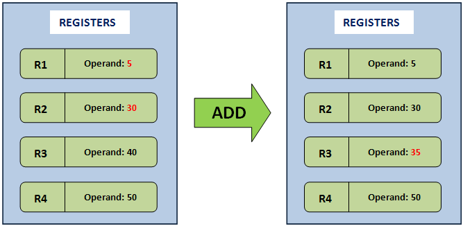
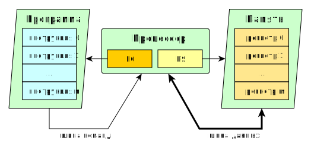

## Регистровые машины
регистровые машины (eng: register machines) 

## Определение
Регистровая машина состоит из конечного числа [регистров](register.md), хранящих неотрицательные целые числа и управляющий программный блок, который выполняет операции над содержимым регистров согласно программе (упорядоченной последовательности команд).
## Примечание
В качестве регистровой виртуальной машины можно назвать [Lua VM](liaVM.md) 
и [Dalvik VM](dalvik.md).

В регистровой реализации [виртуальной машины](virtual_machines_1.md) структура данных, в которую помещаются [операнды](operand.md), основана на [регистрах](register.md) [процессора](processor.md). При этом не требуются операции PUSH или POP, но инструкции должны явно содержать адреса ([регистры](register.md)) в которых содержатся [операнды](operand.md). То есть, [операнды](operand.md) для инструкций, в отличии от стековой модели, указываются явно. 

## Пример
Пример работы регистровой машины на основе операции сложения:

За счет отсутствия операций POP и PUSH команды в регистровой виртуальной машине выполняются достаточно быстро.

Регистровые машины позволяют провести [оптимизацию](code_optimization.md), например несколько раз встречающееся выражение при регистровом подходе может быть вычислено лиш однажды и сохранено в [регистре](register.md) для последующего использования, что экономит время необходимое для пересчета выражения.

Схема регистровой машины:

На иллюстрации приведена условная схема “регистровой машины”, которая состоит из трёх частей: [процессора](processor.md), выполняющего операции над натуральными числами, программы (ПЗУ), которая представляет собой последовательность пронумерованных инструкций и памяти (ОЗУ), состоящей из пронумерованных регистров.

## Cвязь с другими понятиями 
[регистр](register.md)
## Cсылка на библиографию
[savitsky-calculations-book](../bibliography/savitsky-calculations-book.md)
