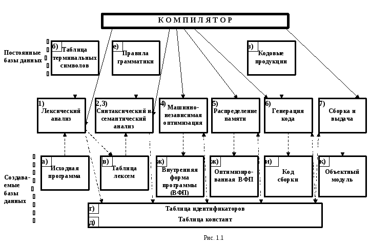

## Исходная программа 
исходная программа (eng: source program) 

## Определение
Исходная программа — текст программы на языке высокого уровня, который должен быть переведен в [машинный код](machine%20code.md).
## Пример
Место исходной программы в структуре [компилятора](compiler.md):

## Связь с другими понятиями
[виртуальные машины](virtual%20machines.md)

[машинный код](machine%20code.md)

## Cсылка на библиографию
[harris-architecture-book{2}](../bibliography/harris-architecture-book%7B2%7D.md)

