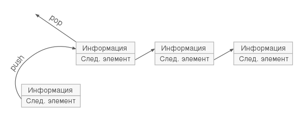

## Стек
стек (eng: stack) 

## Определение
Стек – последовательный контейнер, обеспечивающий вставку элемента в вершину стека и удаление элемента из вершины стека. 
## Пример
Общая схема работы стека:

Возможны три операции со стеком: 
- добавление элемента (иначе проталкивание, push), 
- удаление элемента (pop),
- чтение головного элемента (peek).

При проталкивании (push) добавляется новый элемент, указывающий на элемент, бывший до этого головой. Новый элемент теперь становится головным.

При удалении элемента (pop) убирается первый, а головным становится тот, на который был указатель у этого объекта (следующий элемент). При этом значение убранного элемента возвращается.

## Связь с другими понятиями
[стековые машины](stack_machines.md)

## Cсылка на библиографию
[tuesdays-stack-book](../bibliography/tsyrulnikov-set-book.md)

