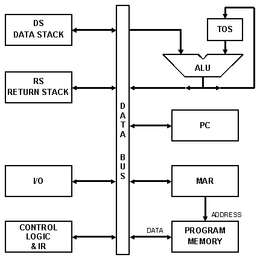

## Стековые машины
стековые машины (eng: stack machines) 

## Определение
Стековая виртуальная машина реализует основные, описанные свойства [виртуальной машины](virtual_machines_1.md) но в качестве структуры данных, куда помещаются операнды, используется [стек](stack.md).
## Пример
 Блок-схема «Классической Стековой Машины»:
 
 

Каждый блок на схеме представляет часть машинной логики, соответствующей минимально необходимому компоненту конструкции. 

В число таких компонентов входят: 
 - [«шина данных»](data_bus.md) ( data bus ), 
 - [«стек данных»](data_stack.md) ( DS ),
 - [«стек адресов возврата» или просто «стек возврата»](stack_of_returns.md) ( RS ),
 - [«арифметическо-логическое устройство»](arithmetic_logic_unit.md) ( ALU ) с регистром «вершина стека» ( TOS ), 
 - «счетчик программы» ( PC ), 
 - «программная память» с «регистром адреса памяти» ( MAR ),
 - управляющая логика с «регистром инструкций» ( IR ) и секция «ввода-вывода» ( I/O ).

## Связь с другими понятиями
[стек](stack.md)
## Cсылка на библиографию
[tuesdays-stack-book](../bibliography/tuesdays-stack-book%7B1%7D.md)

