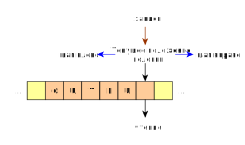

## Машина Тьринга
машина тьюринга(eng: turing machine)
## Определение 
Машина тюринга — абстрактный исполнитель. Машина Тьюринга состоит из бесконечной в обе стороны ленты, разделенной на ячейки, и автомата (головки), которая управляется программой.
## Пример
Лента — запоминающее устройство машины Тьюринга:

Работа запоминающего устройства на каждый шаг автомата состоит из трёх стадий:

Чтение символа из текущей ячейки и отправка его автомату в качестве входа.
Запись выходного символа в текущую ячейку.
Перемещение головки на шаг влево или на шаг вправо.
## Примечание
Другие эквивалентные машины и методы :

-  [Автомат с памятью](automatic%20machine%20with%20memory.md)

-  [Многоленточная машина Тьюринга](multiband%20turing%20machine.md)

-  [Двумерная машина Тьюринга](two-dimensional%20turing%20machine.md)

-  [Клеточный автомат](cellular%20automaton.md)

-  [Лямбда-исчисление](lambda%20calculus.md)

-  [Алгоритм Маркова](markov%20algorithm.md)

## Связь с другими понятиями

[Автомат с памятью](automatic%20machine%20with%20memory.md)

[Многоленточная машина Тьюринга](multiband%20turing%20machine.md)

[Двумерная машина Тьюринга](two-dimensional%20turing%20machine.md)

[Клеточный автомат](cellular%20automaton.md)

[Лямбда-исчисление](lambda%20calculus.md)

[Алгоритм Маркова](markov%20algorithm.md)

## Ссылка на библиографию
[mirzoev-machine-book{2}](../bibliography/mirzoev-machine-book%7B2%7D.md)
