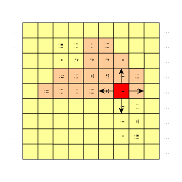

##   Двумерная машина Тьюринга
двумерная машина тьюринга(eng: two-dimensional turing machine) 

## Определение
Двумерная машина Тьюринга вместо одномерной ленты головка [машины Тьюринга](turing_machine.md) может перемещаться по неограниченному во всех направлениях двумерному полю ячеек.
## Пример

## Связь с другими понятиями
[машина Тьюринга](turing_machine.md)
## Ccылка на библиографию
[mirzoev-machine-book{6}](../bibliography/mirzoev-machine-book%7B6%7D.md)
