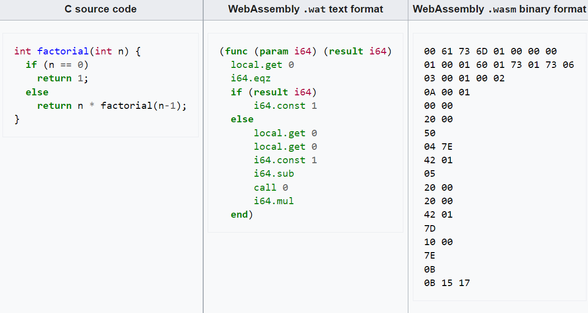

## Веб-асемблер
веб-асемблер (eng: wasm) 

## Определение
WebAssembly ( Wasm ) определяет переносимый формат двоичного кода и соответствующий текстовый формат для исполняемых программ, 
а также программные интерфейсы для облегчения взаимодействия между такими программами и их хост-средой.
## Примечание
Код Wasm ([байт-код](byte-code.md)) предназначен для запуска на портативной машине виртуального стека ([ВМ](virtual_machines_1.md)).
[Виртуальная машина](virtual_machines_1.md) предназначена для более быстрого анализа и выполнения, чем JavaScript, и имеет компактное представление кода.
Внешняя функциональность (например , системные вызовы), которую можно ожидать от двоичного кода Wasm, 
не предусмотрена стандартом. 
Это скорее обеспечивает способ обеспечения взаимодействия через модули хост-средой, в которой работает реализация [виртуальной машины](virtual_machines_1.md). 
## Представление кода
В приведенной ниже таблице показан пример факториальной функции, написанной на C , и соответствующего ей кода WebAssembly после компиляции, 
представленного как в текстовом формате .wat (удобочитаемое текстовое представление WebAssembly), так и в двоичном формате .wasm 
(необработанный байт -код , выраженный ниже в шестнадцатеричном формате ), 
который выполняется веб-браузером или средой выполнения, поддерживающей WebAssembly.

Исходный код C и соответствующий WebAssembly:

## Cвязь с другими понятиями 
[набор команд веб-асемблера](command_set_wasm.md)
