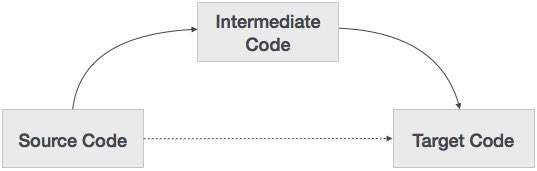

## Промежуточная генерация кода
промежуточная генерация кода(eng: сode generation) 

## Определение
Промежуточная генерация кода — часть [процесса компиляции](compilation_process.md), когда специальная часть [компилятора](compiler_1.md), кодогенератор, конвертирует синтаксически корректную программу в последовательность инструкций, которые могут выполняться на машине. При этом могут применяться различные, в первую очередь машинно-зависимые оптимизации. Часто кодогенератор является общей частью для множества [компиляторов](compiler_1.md). Каждый из них генерирует промежуточный код, который подаётся на вход кодогенератору.
## Способы представления
Промежуточные коды могут быть представлены различными способами:

High Level IR – высокоуровневое представление промежуточного кода очень близко к самому исходному языку. Они могут быть легко сгенерированы из исходного кода, и мы можем легко применить модификации кода для повышения производительности. Но для оптимизации целевой машины это менее предпочтительно.

Низкоуровневое ИК – Это устройство близко к целевой машине, что делает его пригодным для распределения регистров и памяти, выбора набора команд и т. д. Это хорошо для машинно-зависимых оптимизаций.

[Промежуточный код](byte-code.md) может быть либо специфичным для языка (например, Байт-код для Java), либо независимым от языка (трехадресный код).
## Пример
Промежуточная генерация кода:

## Связь с другими понятиями
[компилятор](compiler_1.md)
## Cсылка на библиографию
[harris-architecture-book{3}](../bibliography/harris-architecture-book%7B3%7D.md)

